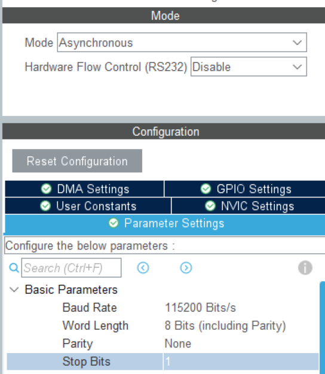
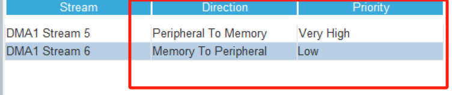

- [cube 配置](#cube配置)
- [代码例程](#代码例程)
- [注意](#注意)

# readme

## cube 配置


如上，确定好要的波特率和长度以及校验



- 注意：若需要使用 DMA，记得启用并根据实际情况配置 <优先级>,以防接收不到数据

## 代码例程

1.引用命名空间后，需要创建一个结构体 //usart_init_t i 2.为其赋值// rxbuf_size,rx/tx_callback 函数，接收发送发送等，具体看 hpp,根据需求不做初始化也可以 3.之后便可以创建类 //usart_c example(usart_init) 4.若有使能中断，则在进入中断后会自动进入自定义的 callback 函数
例程如下：

```language
    void tx_call()
    {
        int i = 0;
    }
    void rx_call(uint8_t *buff, uint16_t size)
    {
        int i = 0;
    }
    uint8_t rx1[286] = {0};
     usart_init_t usart_con =
        {
        .usart_handle_ = &huart2, //hal库usart句柄
        .rxbuf_size_ = 10,        //接收区缓冲大小
        .rx_type_ = USART_RX_DMA_IDLE, //接收类型
        .tx_type_ = USART_TX_DMA,      //发送类型

        .usart_data_length_ = usart_data_length

        .usart_tx_callback_ptr_ = callback_m, //发送回调函数指针
        .usart_rx_callback_ptr_ = rx_call,  //接收回调函数指针
        .rx_buff_ptr = rx1,                 //发送区指针
        .sec_rxbuff_ptr = rx2 //接收区指针--双地址时用
        };
    usart_c test(usart_con);
    uint8_t tx_b[10] = {10, 10, 2, 1};
    test.USART_rx_start();
    while (1)
    {
    test.USART_send(tx_b, 4, 500);
    HAL_Delay(500);
    }
```

- 若需要双缓冲，需要在结构体添加另一指针,并将 DMA 设置为循环(circuar)模式

## 注意

- 若需要使用 DMA，记得启用并根据实际情况配置 <优先级>,以防接收不到数据
- 若需要使用 DMA，记得启用并根据实际情况配置 <优先级>,以防接收不到数据

---

- 若需要双缓冲，需要在结构体添加另一指针,并将 DMA 设置为循环(circuar)模式！！
- 若需要双缓冲，需要在结构体添加另一指针,并将 DMA 设置为循环(circuar)模式！！
若不加：具体表现为只能进一次中断
  关于双缓冲，可以参考王草凡的：https://zhuanlan.zhihu.com/p/720966722
